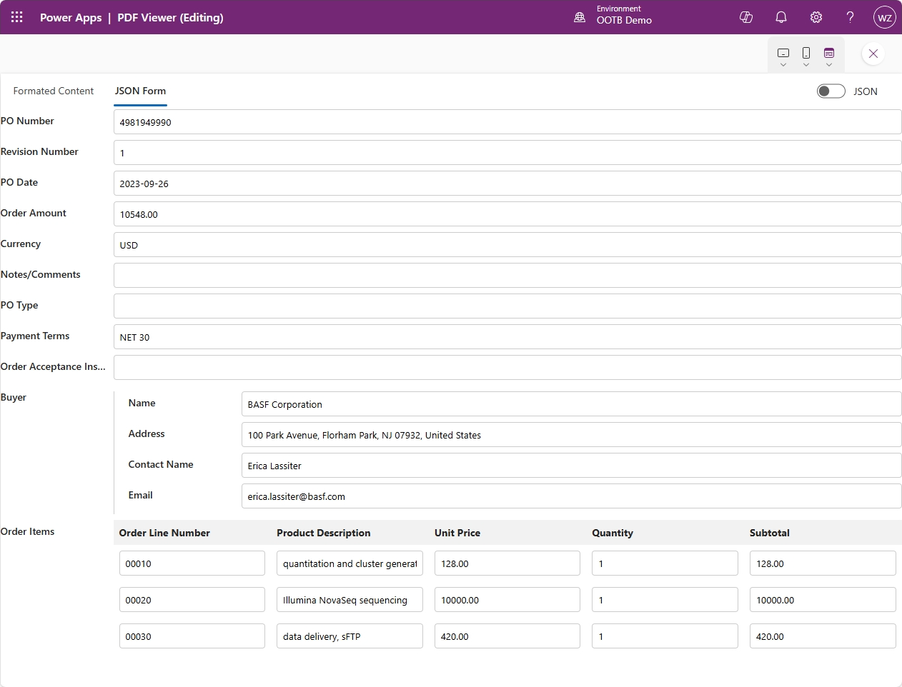
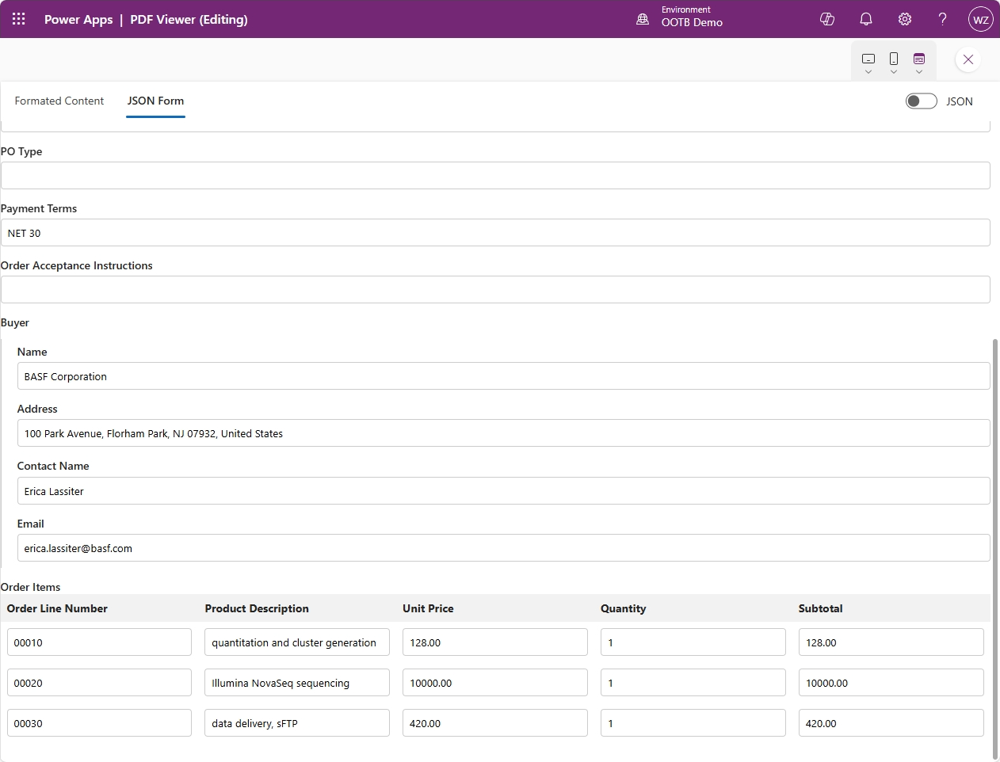
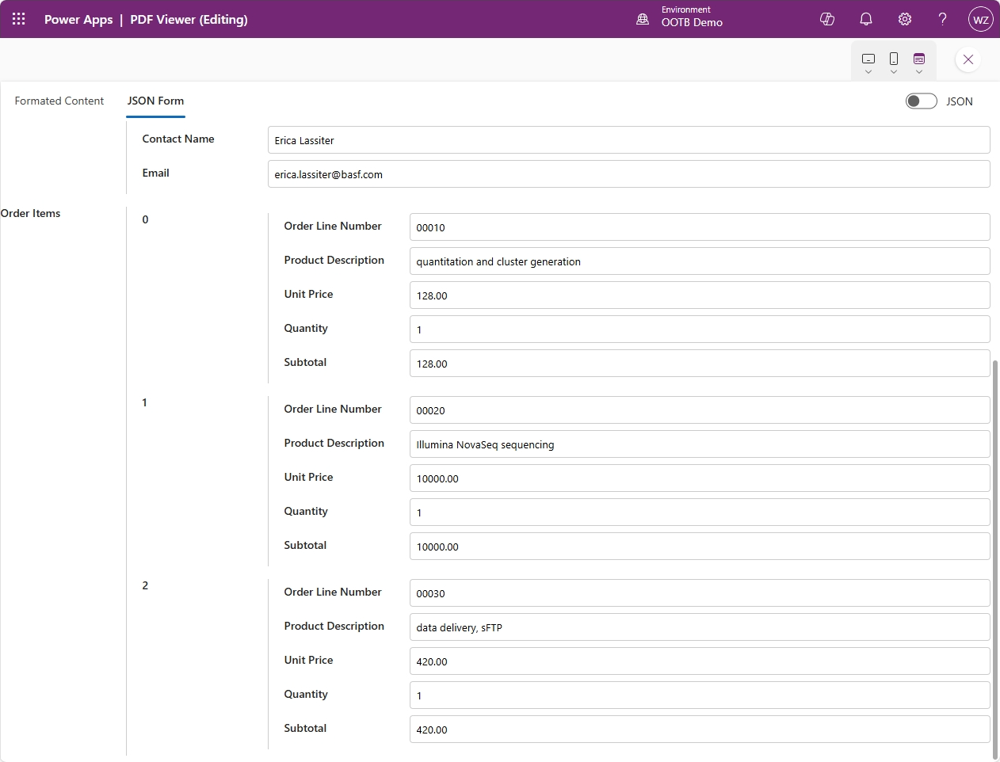

# AnotherJSONForm
## Overview
This is my first PCF component, inspired from project [pcf-form-json](https://github.com/temmyraharjo/pcf-form-json) by temmyraharjo, The reason why I made this another one is because:

>I need a PCF component that can convert any JSON based data into an editable form and doesn't need to pre-define the form structure, the component should render the controls based on the JSON attribute and values dynamically.

Although it's not perfectly done today. But I will keep improving it as it's indeed a critical part in one of my projects.

Btw, this project is work with GitHub Copilot and done in a day. And I Haven't done code thing for a long time, so, I can't do it without GitHub Copilot's support. GitHub Copilot, you deserve a thumb up.
## Component properties
**JSON String**: the json string to display
**Label Position**: left/top
**Invalid JSON Error Message**: the error message to display when JSON string is invalid.
**View Mode**: form/json
**Allow Switch View**: true/false, set to true will display a switch button on the top right cornor.
**Table display style**: table/nested
## Screenshot
Form view

Label position(top/left)

List item display model(table/nested)

Json view with search function
